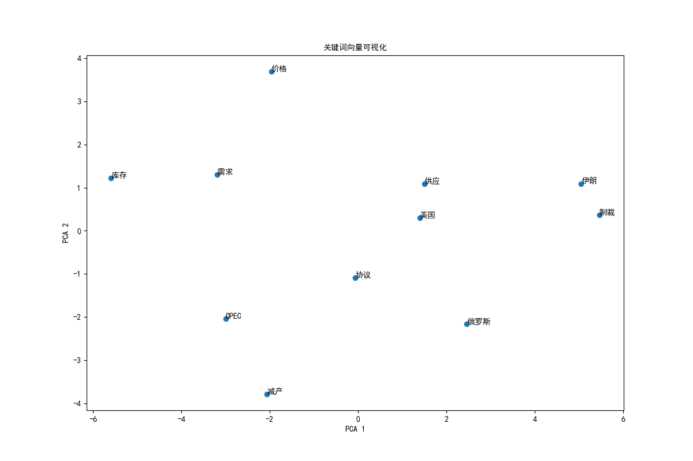
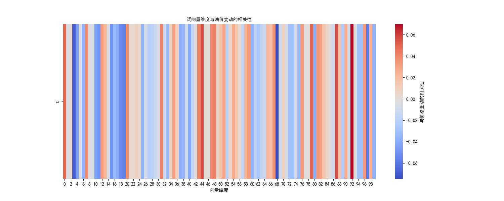

# NLP 模块说明

## 概述

本模块负责处理石油相关的中文事件文本，通过 Word2Vec 进行词向量建模，挖掘文本语义与油价变动之间的关联。

## 功能

1. **中文文本分词**：使用 jieba 对事件描述进行分词
2. **Word2Vec 训练**：训练词向量模型，捕捉关键词语义
3. **向量可视化**：通过 PCA 降维展示关键词向量分布
4. **相关性分析**：计算词向量维度与油价变动的相关性

## 关键词列表

- 减产、制裁、库存、战争、协议、价格
- 需求、供应、OPEC、俄罗斯、美国、伊朗

## 输入输出

**输入**：`data.xlsx`（包含 Event_Description 和 Change 列）

**输出**：
- `oil_price_word2vec.model`：训练好的 Word2Vec 模型
- `text_vectors.csv`：文本向量矩阵
- `oil_data_with_vectors.xlsx`：带向量的完整数据
- `word_vectors.png`：关键词向量可视化（中文）
- `vector_correlation.png`：词向量与油价变动相关性热力图

## 结果展示

### 1. 关键词向量可视化

通过 PCA 将 100 维词向量降维至 2 维，展示关键词的语义空间分布：



**分析**：
- 语义相近的词在空间上聚集在一起
- "减产"、"OPEC" 等词位置接近，反映供需关系
- "俄罗斯"、"伊朗"、"制裁" 聚集，反映地缘政治因素
- "库存"、"价格"、"需求"、"供应" 形成独立聚类，反映市场基本面

### 2. 词向量与油价变动相关性

分析各词向量维度与油价变动（Change）的相关性：



**分析**：
- 热力图展示了 100 个向量维度与价格变动的相关系数
- 红色表示正相关，蓝色表示负相关
- 部分维度与价格变动存在较强相关性，可作为 ML 模型的补充特征
- 可进一步筛选高相关性维度，融合到 ML 预测模型中

## 模型配置

Word2Vec 超参数：
- vector_size: 100
- window: 5
- min_count: 3
- epochs: 50

## 运行方式

```bash
pip install -r requirements.txt
python oil_price_nlp.py
```
